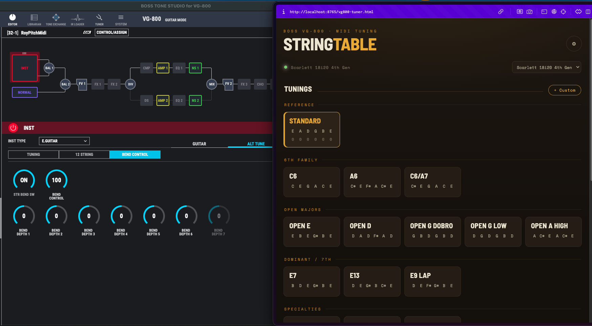
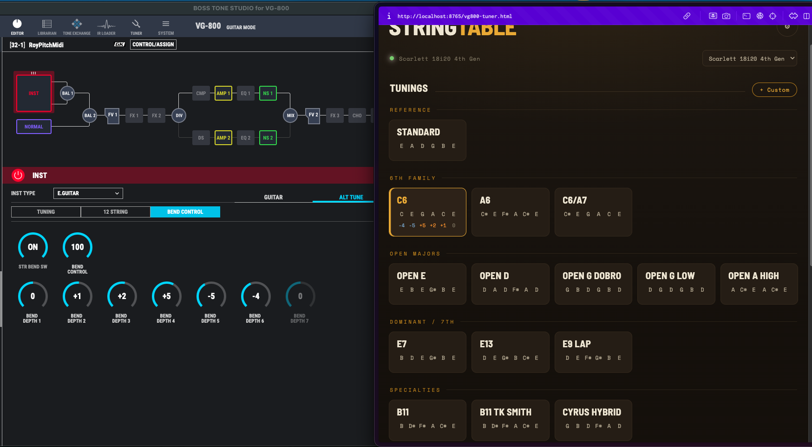
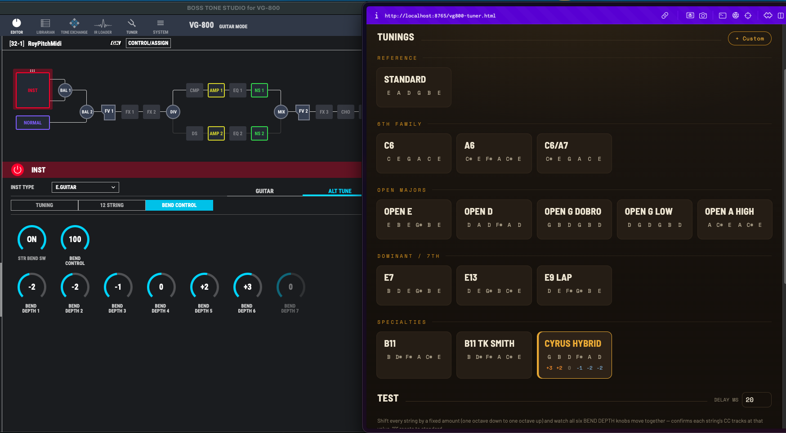

# VG800 MIDI Control — Boss VG-800 tuning from the browser

Pick an alternate tuning in your browser and the **Boss VG-800** retunes every string instantly over MIDI — no menu diving. It's a single self-contained HTML file (no build step, no dependencies) that uses the **Web MIDI API** to send Control Change messages to the VG-800's per-string **String Bend** engine.

**▶ Live app: https://fxcircus.github.io/boss-vg800-midi-control-from-browser/**
(Open in Chrome or Edge, allow MIDI, and select your interface — GitHub Pages is served over HTTPS, so Web MIDI works.)



*The app (right) next to Boss Tone Studio (left). Selecting **STANDARD** sends every string a "0" offset, so all six BEND DEPTH values sit at 0 and the guitar plays in standard `E A D G B E`.*

---

## How it works

Each of the six strings is controlled by its own MIDI **CC number**. The app converts a per-string semitone offset (−12 … +12) into a CC value (0 … 127) and sends it on the VG-800's receive channel. On the VG-800, each of those CCs is assigned to a **STR BEND → BEND DEPTH** parameter with a range of −12 … +12 semitones, so the CC value maps linearly onto the string's pitch shift.

- Offset `0` → CC `64` → 0 semitones
- Offset `−12` → CC `0` → one octave down
- Offset `+12` → CC `127` → one octave up

Click a tuning and all six strings retune at once.



*Selecting **C6** shifts the strings by `0 +1 +2 +5 −5 −4` (high E → low E). You can see those exact values land on BEND DEPTH 1–6 on the VG-800, producing `C E G A C E`.*



*Any of the built-in tunings — or your own **+ Custom** tunings — work the same way. Here **Cyrus Hybrid** is applied and the six BEND DEPTH knobs move to match.*

---

## VG-800 setup (do this once)

### 1. Turn on String Bend and set Bend Control to 100

In **INST → STR BEND** (Bend Control tab):


- **STR BEND SW = ON**
- **BEND CONTROL = 100**

This is essential: the VG-800 only applies **BEND DEPTH** to the pitch when **BEND CONTROL is 100**. At 0 (its normal default) the depth values are ignored and nothing changes, no matter what the app sends. The seven **BEND DEPTH** knobs above are the per-string pitch shifts (DEPTH 1 = high E … DEPTH 6 = low E; DEPTH 7 is unused on a 6-string) — these are what the app drives over MIDI.

### 2. Map each string's BEND DEPTH to a CC number

Under **CONTROL/ASSIGN → ASSIGN**, create one assign per string. Here's a single assign in detail:


Every assign uses the same pattern:

- **TARGET CATEGORY** = `INST:STR BEND(A)`
- **TARGET PARAMETER** = `DEPTH n` (the string)
- **TARGET MIN** = `−12`, **TARGET MAX** = `+12`
- **MODE** = `MOMENT`
- **SOURCE** = the CC number for that string

Repeat for all six strings:


| ASSIGN | TARGET (INST:STR BEND(A)) | String | SOURCE | TARGET MIN | TARGET MAX | MODE |
|:------:|:--------------------------|:-------|:-------|:----------:|:----------:|:-----|
| 1 | DEPTH 1 | high E (1st) | `CC# 30` | −12 | +12 | MOMENT |
| 2 | DEPTH 2 | B (2nd)     | `CC# 31` | −12 | +12 | MOMENT |
| 3 | DEPTH 3 | G (3rd)     | `CC# 64` | −12 | +12 | MOMENT |
| 4 | DEPTH 4 | D (4th)     | `CC# 65` | −12 | +12 | MOMENT |
| 5 | DEPTH 5 | A (5th)     | `CC# 66` | −12 | +12 | MOMENT |
| 6 | DEPTH 6 | low E (6th) | `CC# 68` | −12 | +12 | MOMENT |

Notes:

- **DEPTH 1 is the high E string** and DEPTH 6 is the low E — the app already sends in this order.
- **MODE must be `MOMENT`, not `TOGGLE`.** Toggle latches the value to only the min/max extremes; moment lets the incoming CC track continuously across the −12 … +12 range.
- The VG-800 only exposes **CC# 1–31 and CC# 64–95** as assign sources (CC# 32–63 aren't selectable), which is why the mapping skips into the 60s.
- Set **MIDI → RX CHANNEL** to match the app's channel (default **1**).
- These CC numbers must match the app's **⚙ Settings → CC number per string**. They're the defaults, so out of the box they already line up.

---

## Running it

Web MIDI only works from a **secure context**, so you must serve the file over `http://localhost` — opening it as a `file://` path will fail with "MIDI access denied."

```bash
cd boss-vg800-midi-control-from-browser
python3 -m http.server 8765
```

Then open **http://localhost:8765/vg800-tuner.html** in **Chrome or Edge** (Safari and Firefox don't support the Web MIDI API), allow MIDI access when prompted, and pick your audio interface's MIDI output from the dropdown.

> Tip: to stop Chrome re-asking for MIDI permission, open the site-info menu (icon left of the address bar) → **MIDI devices → Allow**. Permission is remembered per origin, so keep using the same `localhost:8765` URL.

---

## Using it

- **Tuning cards** — click any tuning to retune all six strings: 6th/open/dominant families, **Drop** (D → A), **Modal** (DADGAD, Nashville high-strung), and an **Artists** set (Fripp NST, Gambale, Jimmy Page's Rain Song, Sonic Youth, Nick Drake, Keith Richards, American Football, Soundgarden, Joni Mitchell).
- **Ethnic Instruments** — mandolin, Irish/Greek bouzouki, oud, charango, saz/bağlama, cavaquinho, balalaika. Each maps its (3–6) pitches onto a chosen cluster of strings — pick the placement with the string-dot buttons — while the remaining strings return to standard.
- **Pedal Steel** — load a real steel tuning (**E9 Nashville**, **C6 Swing/Jazz**, **B6 Universal**) and pick which contiguous **6 of the 10** strings map onto the guitar (windows 3–8 / 1–6 / 4–9 / 5–10, with a mini string graphic). The Steel Pedals section below then **reconfigures to that tuning's real copedent** (E9 A/B/C + knees, C6's boo-wah set, etc.), targeting the correct strings by scale degree and greying out any pedal whose degree isn't in the chosen window.
- **Steel Pedals** — hold the on-screen **A / B** pedals and **LKL / LKR** knee levers (or keys `A`, `B`, `Z`, `X`) to bend the root / 3rd / 5th of the *current* tuning, pedal-steel style. They stack, each button previews the destination pitches for the selected tuning, and any bend that would exceed ±12 greys out. **Combos** (A+B "cry", keys `V` / `C`) engage a whole grip at once.
- **Jump-to sidebar** (wide screens) — a left nav to hop between tuning families and sections; the Current Tuning readout lives here to save vertical space.
- **+ Custom** — dial each string up/down from standard, name it, and save your own tuning.
- **All strings** — buttons from −12 to +12 shift every string by a fixed amount at once; handy for verifying each string's CC tracks across its whole range. `DELAY MS` spaces out the six messages (also applied to normal tuning changes).
- **⚙ Settings** — MIDI channel, the per-string CC numbers, and **String glide** (ms to slide between tunings; 0 = instant, higher values give portamento/slide effects as the strings ramp to their new pitches).
- **Themes** (⚙ Settings → Theme) — **BOSS Blue** (default, brushed-metal blue) or **Workbench** (warm wood/brass). Your choice is remembered.

---

## Browser support

Requires the **Web MIDI API**: Chrome, Edge, and other Chromium browsers. Not supported in Safari or Firefox.
