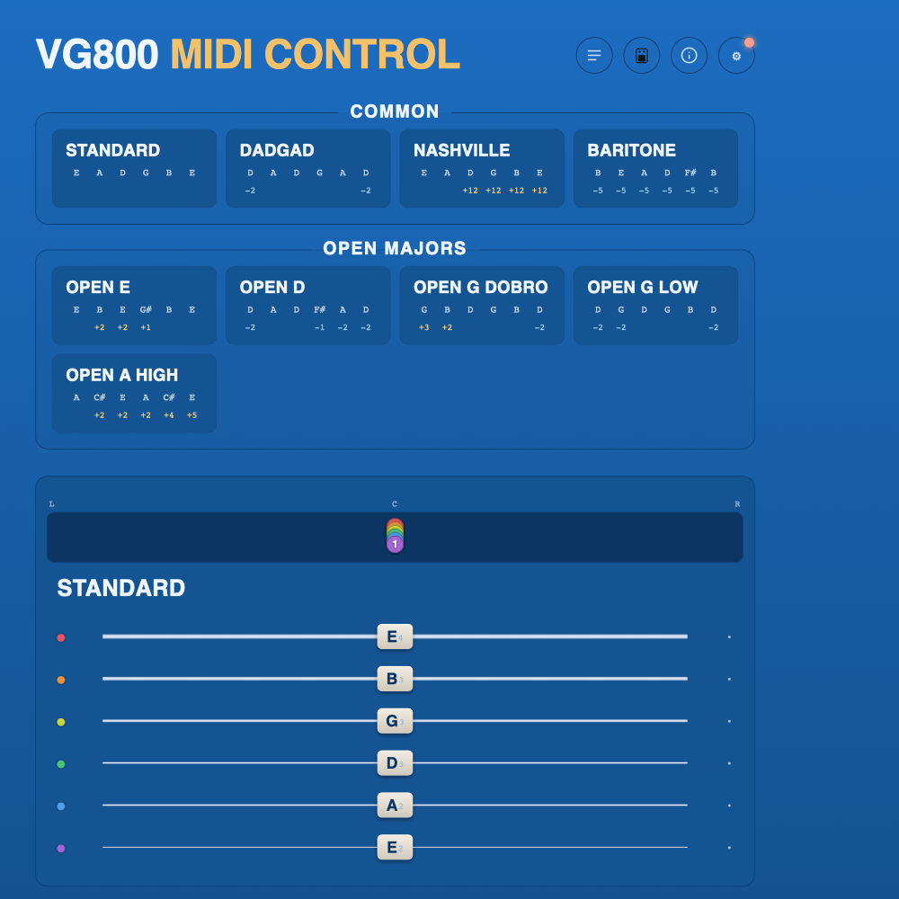
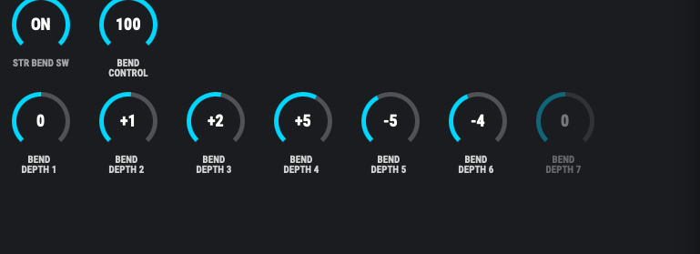
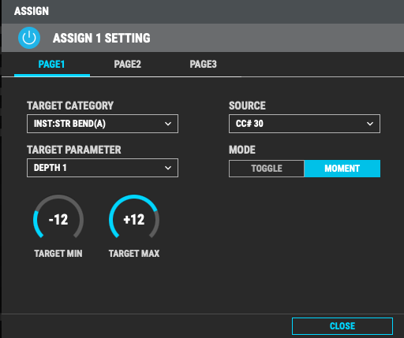
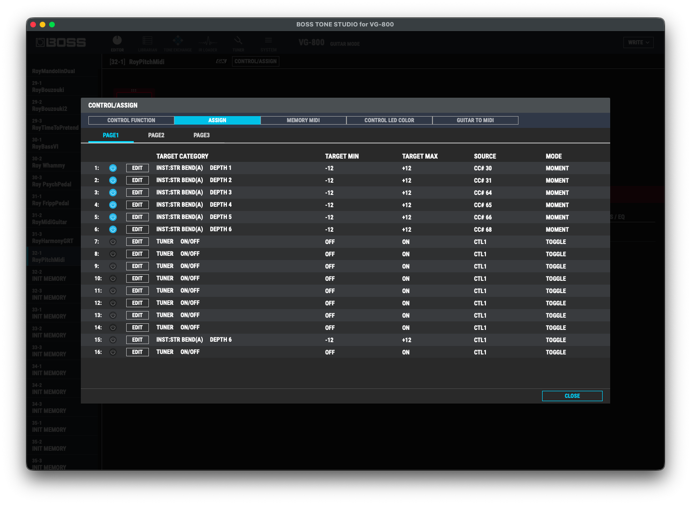
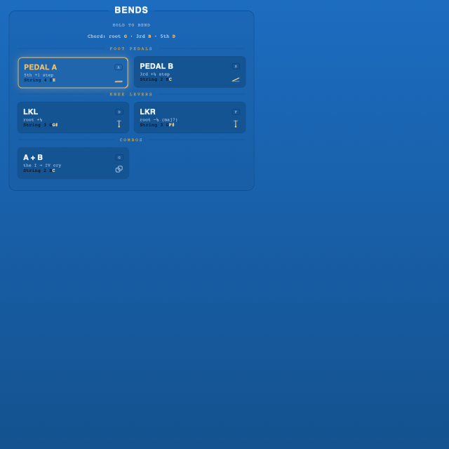

# VG800 MIDI Control — retune your Boss VG-800 from the browser

Pick an alternate tuning and all six strings of your **Boss VG-800** retune instantly over MIDI — no menu-diving. It also does pedal-steel **bends**, ethnic-instrument voicings and stereo **auto-panning**, all from a single self-contained HTML page (no build step, no dependencies) that talks to the pedal through the **Web MIDI API**.

**▶ Live app: https://fxcircus.github.io/boss-vg800-midi-control-from-browser/**
Open in **Chrome or Edge**, allow MIDI, and pick your interface. (GitHub Pages serves over HTTPS, so Web MIDI works.)

☕ Like it? [Buy me a coffee](https://buymeacoffee.com/fxcircus).



---

## Quick start

1. Open the [live app](https://fxcircus.github.io/boss-vg800-midi-control-from-browser/) in **Chrome or Edge** (Safari & Firefox don't support Web MIDI) and allow MIDI access when asked.
2. Open **⚙ Settings → MIDI Output**, pick your interface's output port and set **Channel** to match the VG-800 (factory default **1**). The dot on the ⚙ button glows **green** once a port is live.
3. Click any **tuning card** — all six strings retune at once.
4. First time connecting the hardware? Do the [one-time VG-800 setup](#one-time-vg-800-setup) below so the pedal actually responds.

---

## How it works

The app drives one of two VG-800 presets, switched with **⚙ Settings → Mode**. Each spends the pedal's 16 assign slots differently, so each mode is *for* something different:

- **Classic** (default) — *for expressive playing*: bends that actually **glide** into pitch (pedal-steel moves, per-string benders, scale bends), and Ethnic instruments at **true pitch** with no capo. The trade-off: no stereo panning.
- **Panning** — *for the stereo field*: per-string placement and the auto-pan LFO engine. Bends still work but *step* instantly to pitch instead of gliding.

Ready-made hardware presets for both live in [`presets/`](presets/) — see [Ready-made presets](#ready-made-presets-the-fast-way) below.

### Classic mode (the default)

The tuning lives on **INST:ALT TUNE** (User mode — save it **ON in the patch**; there's no CC for it in this preset). Each string's base pitch is one **ALT TUNE · PITCH** assign with **MIN `−24` / MAX `+24`**, so a semitone offset maps to a CC value as `CC = round((st + 24) / 48 × 127)`:

- Offset `0` → CC `64` (the center is the same in every scaling)
- Offset `+12` → CC `95` · Offset `−12` → CC `32`
- Offset `+24` → CC `127` · Offset `−24` → CC `0`

Bends are the pedal's true two-step gesture: the app writes each string's **STR BEND · BEND DEPTH** (relative, −12 … +12, `CC = round((st + 12) / 24 × 127)`), then sweeps **BEND CONTROL** 0→100 so the pitch **glides** into the note — and glides back on release — exactly like working the knob by hand. Stereo panning is unavailable in this mode: the VG-800 has only 16 assign slots, and CC# 71–76 are spent on the ALT TUNE pitches.

Classic also carries **guitar-model auto-select** (the **Auto / Manual** toggle in the GUITAR card's corner): each tuning can switch the VG-800's instrument model with **two CC messages in order** — first **INST · TYPE** (CC# 70: low = E.GUITAR, high = ACOUSTIC) picks the category, then **INST:E.GTR · TYPE** (CC# 77) or **INST:ACOUSTIC · TYPE** (CC# 78) picks the model within it. See [TUNINGS.md](TUNINGS.md) for the model chosen per tuning. Because CC# 77 is spent on the electric model, **12-string has no CC in Classic** — toggle it on the pedal itself (**▲**).

The **GUITAR card** (under Bends) is the manual side of the same control: Electric/Acoustic tabs, a chip per model (labeled with the real instrument — Fender Stratocaster, Gibson Les Paul Junior…) and a line-art portrait of the current one. Picking a chip sends the same two-message sequence immediately — even in **Manual** mode (a click is explicit intent; the Auto/Manual toggle in the card's corner only governs what happens when a tuning is applied: **Auto** lets every tuning pick its model, **Manual** keeps your pick). The selected model persists across page reloads. The card lives in Classic only — in Panning those CCs mean pan and 12-string.

### Panning mode (alternate preset)

The older, simpler preset: each string's full pitch offset (−12 … +12) writes straight to its **BEND DEPTH** (so notes *step* to pitch rather than glide, and **BEND CONTROL must sit at 100** on the pedal), and CC# 71–76 drive **STRING(A) · PAN 1–6** (MIN `L50` / MAX `R50`) for the stereo-spread and auto-pan features.

### Classic-mode assign table

| ASSIGN | TARGET | SOURCE | MIN | MAX | MODE |
|:------:|:-------|:-------|:---:|:---:|:-----|
| 1–6 | INST:STR BEND(A) · DEPTH 1–6 | `CC# 30, 31, 64, 65, 66, 68` | −12 | +12 | MOMENT |
| 7 | INST:STR BEND(A) · BEND CONTROL | `CC# 69` | 0 | 100 | MOMENT |
| 8 | INST · TYPE | `CC# 70` | E.GUITAR | ACOUSTIC | MOMENT |
| 9–14 | INST:ALT TUNE(A) · PITCH 1–6 | `CC# 71–76` | −24 | +24 | MOMENT |
| 15 | INST:E.GTR · TYPE | `CC# 77` | CLA-ST | FRETLESS | MOMENT |
| 16 | INST:ACOUSTIC · TYPE | `CC# 78` | MA28 | SITAR | MOMENT |

Model CC values (an even 0–127 spread — centralized in the app as `EGTR_MODELS` / `ACOUSTIC_MODELS`, adjust there after hardware testing):

| CC# 77 (electric) | value | | CC# 78 (acoustic) | value |
|:---|---:|---|:---|---:|
| CLA-ST | 0 | | MA28 | 0 |
| MOD-ST | 12 | | TRP-0 | 16 |
| TE | 23 | | GB45 | 32 |
| LP | 35 | | GB SML | 48 |
| P-90 | 46 | | GLD 40 | 64 |
| 335 | 58 | | NYLON | 79 |
| L4 | 69 | | RESO | 95 |
| RICK | 81 | | BANJO | 111 |
| LIPS | 92 | | SITAR | 127 |
| WIDE RANGE | 104 | | | |
| BRIGHT HUM | 115 | | | |
| FRETLESS | 127 | | | |

**12-string** and **ALT TUNE ON/OFF** have no assign slots in this preset: toggle 12-string on the pedal (**▲**), and save the patch with ALT TUNE **ON**.

In Classic the Ethnic **+ Octave** lift is baked into the ALT TUNE base pitches (the ±24 range leaves room), so a mandolin or ukulele sounds at real pitch on the open strings — play the "0 fret" instead of capoing the 12th. In Panning mode CC# 78 toggles the preset's fixed +12 as before.

---

## One-time VG-800 setup

Configure the pedal once so it listens to the app.

### Ready-made presets (the fast way)

Skip the manual mapping below — import a preset that already has every assign wired:

| Mode | Preset file | Direct download |
|:-----|:------------|:----------------|
| **Classic** (default) | [`presets/royClassic.tsl`](presets/royClassic.tsl) | [royClassic.tsl](https://fxcircus.github.io/boss-vg800-midi-control-from-browser/presets/royClassic.tsl) |
| **Panning** | [`presets/royPanning.tsl`](presets/royPanning.tsl) | [royPanning.tsl](https://fxcircus.github.io/boss-vg800-midi-control-from-browser/presets/royPanning.tsl) |

1. Download the `.tsl` for the mode you want (or clone the repo — they're in `presets/`).
2. Open **Boss Tone Studio for VG-800** → **LIBRARIAN** → import the `.tsl` liveset.
3. Write the patch to the pedal and select it.
4. Make sure the app's **⚙ Settings → Mode** matches the preset you loaded, and **MIDI → RX CHANNEL** matches the app's channel. Done.

### 1. Set up ALT TUNE and String Bend (manual alternative)

For **Classic mode** (the default):

- **INST → ALT TUNE**: MODE = `ALT TUNE`, TUNING TYPE = `USER`, switched **ON** and **saved ON in the patch** (there is no CC for it in this preset). It carries the tuning — the app writes the per-string PITCH values over MIDI.
- **INST → STR BEND**: **STR BEND SW = ON**. Leave BEND CONTROL alone — the app drives it (resting at 0, swept to 100 for each bend so the pitch glides).
- Map the full 16-slot assign table above (**CONTROL/ASSIGN → ASSIGN**).

For **Panning mode** (the alternate preset), in **INST → STR BEND** (Bend Control tab):



- **STR BEND SW = ON**
- **BEND CONTROL = 100**

This is essential in Panning mode — the VG-800 only applies **BEND DEPTH** when **BEND CONTROL = 100**. At 0 (its normal default) the depth values are ignored and nothing changes, no matter what the app sends. The **BEND DEPTH** knobs are the per-string pitch shifts (DEPTH 1 = high E … DEPTH 6 = low E; DEPTH 7 is unused on a 6-string).

### 2. Map each string's BEND DEPTH to a CC number (both modes)

Under **CONTROL/ASSIGN → ASSIGN**, create one assign per string:



Every assign uses the same pattern:

- **TARGET CATEGORY** = `INST:STR BEND(A)`
- **TARGET PARAMETER** = `DEPTH n` (the string)
- **TARGET MIN** = `−12`, **TARGET MAX** = `+12`
- **MODE** = `MOMENT`
- **SOURCE** = the CC number for that string

Repeat for all six strings:



| ASSIGN | TARGET (INST:STR BEND(A)) | String | SOURCE | MIN | MAX | MODE |
|:------:|:--------------------------|:-------|:-------|:---:|:---:|:-----|
| 1 | DEPTH 1 | high E (1st) | `CC# 30` | −12 | +12 | MOMENT |
| 2 | DEPTH 2 | B (2nd)     | `CC# 31` | −12 | +12 | MOMENT |
| 3 | DEPTH 3 | G (3rd)     | `CC# 64` | −12 | +12 | MOMENT |
| 4 | DEPTH 4 | D (4th)     | `CC# 65` | −12 | +12 | MOMENT |
| 5 | DEPTH 5 | A (5th)     | `CC# 66` | −12 | +12 | MOMENT |
| 6 | DEPTH 6 | low E (6th) | `CC# 68` | −12 | +12 | MOMENT |

Notes:

- **DEPTH 1 is the high E string**, DEPTH 6 the low E — the app already sends in this order.
- **MODE must be `MOMENT`, not `TOGGLE`** so the incoming CC tracks continuously across the −12 … +12 range instead of snapping to the extremes.
- The VG-800 exposes only **CC# 0–31 and 64+** as assign sources (32–63 aren't selectable) and may not track 64–95 continuously — prefer CC# **1–31**.
- Set **MIDI → RX CHANNEL** to match the app's channel. These CC numbers are the app's defaults, so out of the box they already line up (see **⚙ Settings → CC numbers**).

---

## Features

- **Tuning cards** — click to retune all six strings. Families: **Common** (Standard, DADGAD, Nashville, Baritone, Bass VI, Hendrix), **Open Majors**, **Drop**, and an **Artists** set (Fripp NST, Gambale, Page's Led Kashmir and Led Rain, Sonic Youth, Nick Drake, Keith Richards, American Football, SoundG Wave and SoundG Sun, Joni Cab, Joni Sides, Radio Pyramid, Radio Everything). Each card shows its note names and per-string ± offset. **See [TUNINGS.md](TUNINGS.md) for the complete list** (every tuning with its notes and offsets).
- **Modes** — the seven diatonic modes on a **selectable root** (any of the 12 keys), ordered brightest→darkest so each adjacent mode flattens exactly one string; at C the **White Keys** base card (**C D E F G A**) shows the source set. All twelve roots work in **Classic** (its ±24 ALT TUNE range absorbs the shift); **F, F♯ and G** need it, so they disable in Panning mode. In this section the **Bends** pedals bend to the current mode's 7th degree (**7th ↑** lifts the high E, **7th ↓** drops the low E) plus a **Color Tone** pedal to each mode's characteristic note — retargeting with each mode and root.
- **Ethnic** — mandolin, Irish/Greek bouzouki, oud, charango, saz/bağlama, sitar (with meend bend pedals), cavaquinho, balalaika, 5-string banjo. Each maps the instrument's pitches onto a chosen cluster of strings (pick the placement with the string-dot buttons). A **capo hint** says where to physically capo, since the VG-800 only bends ±12 semitones.
- **Pedal Steel** — load a real steel tuning (**E9 Nashville**, **C6 Swing/Jazz**, **B6 Universal**) and choose which contiguous **6 of the 10** strings map onto the guitar; the **Bends** section reconfigures to that tuning's copedent.
- **Bends** — hold the on-screen benders — **Sixth**, **Sus 4**, **Minor**, **Maj 7** (keys <kbd>A</kbd> <kbd>S</kbd> <kbd>D</kbd> <kbd>F</kbd>), each named for the colour it pulls the tuning into — pedal-steel style (the Pedal Steel section keeps the authentic Pedal A/B/C names). They stack, the icons animate as they move, and in **Panning** mode any bend that would push base + bend past ±12 greys out (in **Classic** bends are relative to the ALT TUNE base, so range never limits them). **Combos** (A+B…) engage a whole grip at once. **Latch** toggles instead of holding; **Key Mapping** lets you rebind any control to a key.
- **Per-String bends** — a **Preset ⟷ Per-String** switch turns the six pedals into one-per-string manual benders (keys <kbd>A</kbd>–<kbd>H</kbd>). Dial each string up or down with **−/＋**: in **Classic** the bend rides on top of the ALT TUNE base, so the full ±12 is always available on every tuning; in **Panning** base + bend share one ±12 parameter, so the tuning eats into the range (a pedal greys out past it). Save the six amounts as named **presets** and recall them on any tuning — the loaded preset's chip stays lit until the amounts change — with factory quick presets for uniform shifts (±1, ±2, 4th/5th/octave) plus **B-Bender**, **G-Bender**, **Drop Low** (instant Drop D) and **Nashville** (lower four strings up an octave). An **All Strings** pedal (<kbd>J</kbd>, rebindable) pushes every set bender in one press — load *4th ↑* and glide the whole guitar up a fourth on one key.
- **Guitar picker** *(Classic mode)* — a **GUITAR card** under Bends with Electric/Acoustic tabs and all **21 VG-800 models** (CLA-ST → FRETLESS, MA28 → SITAR) as chips, each drawn as a recognizable line-art portrait in the preview pane (pickup-type models — MOD-ST, WIDE RANGE, BRIGHT HUM — show a pickup close-up, like the VG-800's own display). A chip click switches the hardware model instantly via CC# 70 + 77/78 and works even when auto-select is Off; tuning cards keep auto-picking their own model while Auto is on.
- **Panning & auto-pan** *(Panning mode)* — manual stereo modes (Center, Equal Spread, Split, Zig-Zag, Pairs…) glide each string to its new position; the **Pan glide** toggle sets the sweep time (Instant → Long). **Auto-pan** gives each string its own pan LFO with character presets (**Rotate, Leslie, Fan Breathe, Ping-Pong, Drift**), Width, Shape, Phase spread, and Free-rate or Tempo-synced timing. Hidden in Classic mode, where CC# 71–76 carry the ALT TUNE pitches instead.
- **Current Tuning readout** — an always-on panel combining pitch and pan for all six strings: a **pan strip** up top over a **pitch neck** where each note slides flat↔sharp from standard. Updates and animates live from the current tuning, bends and panning. On wide screens it parks in the left sidebar; on very wide screens it moves to a **right-hand rail together with the whole Bends panel**, so both stay in view while you browse tunings.
- **Themes & display** — the pedal button (top-right) opens the theme picker: **DD500** (default), **GT1000, CS3, RC500, DS1**, each styled after a Boss pedal. **Compact mode** hides note/offset text on cards to fit more on screen.
- **⚙ Settings** — MIDI Output (port + channel), **Mode** (**Classic** ⟷ **Panning**, plus the **Guitar model** auto-select toggle), CC numbers (per-string pitch + alt-tune/pan), and **Bend effect** (a Panning-mode scoop articulation into each new tuning). The Classic **Bend time** control lives in the Bends panel itself.
- **+ Custom tuning** — dial each string ±12 from standard, name it and save it.



---

## Run it locally

Web MIDI needs a **secure context**, so serve over `http://localhost` — opening the file as a `file://` path fails with "MIDI access denied."

```bash
git clone https://github.com/fxcircus/boss-vg800-midi-control-from-browser.git
cd boss-vg800-midi-control-from-browser
python3 -m http.server 8765
```

Then open **http://localhost:8765/vg800-tuner.html** in **Chrome or Edge**, allow MIDI when prompted, and pick your interface's MIDI output.

> Tip: to stop Chrome re-asking for MIDI permission, open the site-info menu (icon left of the address bar) → **MIDI devices → Allow**. Permission is remembered per origin.

---

## Troubleshooting

- **Nothing changes?** Check the **green dot** on ⚙ (MIDI connected), that the app's **Mode** (⚙ Settings) matches the preset loaded on the VG-800 — Classic wants ALT TUNE ON with the 16-slot table; Panning wants **BEND CONTROL = 100** — and that the app's CC numbers match your assigns.
- **Wrong strings move?** Confirm the DEPTH → CC mapping order (DEPTH 1 = high E) and that MODE is `MOMENT`.
- **No sound / no MIDI?** Use Chrome or Edge over HTTPS or `localhost`, and select the correct output port in Settings.

---

## Browser support

Requires the **Web MIDI API**: Chrome, Edge and other Chromium browsers. Not supported in Safari or Firefox.
